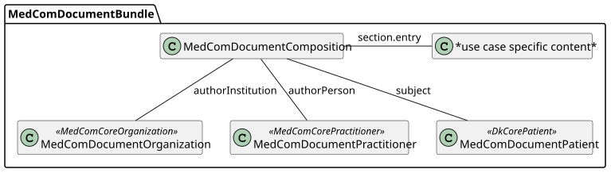

# Logisk FHIR-model for en henvisningsmeddelelse

<<<<<<< Updated upstream
This Implementation Guide (IG) is provided by MedCom to describe the use of FHIR ®© in document-based exchange of data in Danish healthcare.

The IG contains profiles that are used to define a general model for MedCom FHIR documents. The use case-specific profiles are maintained in individual IGs.

The profiles build upon the knowledge obtained through the use of CDA in Denmark and the work around [FHIR documents from HL7 International](https://hl7.org/fhir/R4/documents.html).

#### General Document Model

The figure below illustrates a general document model, which all MedCom documents will comply to. Document profiles in this IG are all prefixed  with "MedComDocument". Besides the profiles shown in the figure, a MedCom document can also include some MedCom Core profiles and profiles made to support a specific use case. Altogether they constitute the actual content of a MedCom FHIR document. The following sections describe the overall purpose of each document profile.



The figure shows the general MedCom document model. It is a structural overview of a MedCom Document Bundle, illustrating the relationships between Bundle, Composition, authorPerson, subject (patient), and referenced resources such as Practitioner, PractitionerRole, Organization, RelatedPerson, Device, and use-case–specific content.

##### MedComDocument Profiles
You will find a list of all MedCom Document profiles in the "Profiles" tab in the menu.

##### Resource Identifiers in MedCom FHIR Documents

In FHIR, `Resource.identifier` is intended to capture business identifiers that remain constant across system boundaries, which differs from `Resource.id`, the internal technical identifier used within a single FHIR Bundle.
All resources included in a MedCom FHIR document **MUST** carry an `identifier` element consisting of both a `system` and a `value`. The identifier SHALL be globally unique, persistent, and stable over time. This means that the identifier **MUST NOT** change as long as the resource represents the same underlying real-world entity or dataset. For example, a Patient resource will always carry the same civil registration number (CPR) as its identifier.

**Global uniqueness:** To ensure global uniqueness, implementations may for example use UUIDv4 or UUIDv5. Use authoritative identifiers when available, such as CPR numbers or SOR codes.

**Persistence across snapshots:** Even if a document is re-created or updated, resources representing the same entity (e.g., Patient, Practitioner, Organization, Encounter) **MUST** retain their identifier.

**Bundle.identifier:** Once a document is assembled into a Bundle, the document is immutable, meaning its content cannot be changed, and the document id (Bundle.identifier) can never be reused. 

##### XML and JSON
**XML and JSON:** Note that the document may be represented in either XML or JSON and interconverted between these or have its character encoding changed, all the while remaining the same document. 

#### Terminology IG and metadata IG
In the [MedCom Terminology IG](http://medcomfhir.dk/ig/terminology/) all referenced MedCom Terminology CodeSystems and Value sets developed by MedCom can be found.

In the [MedCom Terminology for XDS Metadata](https://medcomfhir.dk/ig/xdsmetadata/) all MedCom CodeSystems and Value sets related to metadata can be found.

**Note** that the IG versions linked may be newer than the versions used as dependencies in this implementation guide. For the exact dependency versions applied, see the **Dependencies** tab in the top menu under **More**.

#### Dependencies
Besides Terminology and metadata IGs, this IG has a dependency to the [MedComCore IG](http://medcomfhir.dk/ig/core/), [DK-core](https://hl7.dk/fhir/core/), defined by [HL7 Denmark](https://hl7.dk/) and [IHE MHD](https://profiles.ihe.net/ITI/MHD/). **Note** that the IG versions linked may be newer than the versions used as dependencies in this implementation guide. For the exact dependency versions applied, see the **Dependencies** tab in the top menu under **More**.

### Documentation
[More information about MedCom Document](https://medcomdk.github.io/dk-medcom-document/) can be found here. MedCom document profiles does not alone constitute a standard.

### Governance and guidance
FHIR profiles are managed under MedCom: [Source code](https://github.com/medcomdk/dk-medcom-document).

A description of governance and guidance for MedCom's FHIR standards, can be found on the [MedCom Landing Page](https://medcomdk.github.io/MedComLandingPage).

The MedCom FHIR landing page provides an overview of governance requirements that apply to MedCom’s FHIR standards. This includes e.g. the mandatory rules for interpreting MustSupport, the formal validation requirements that implementers must follow, the expectations for producing narrative texts and governance for how MedCom Terminology is versioned. In addition, the governance section outlines the rules for MedCom FHIR Messaging and Document Sharing, including requirements for e.g. message flow and envelope usage.

The landing page also offers help to developers to understand how to work with MedCom’s FHIR standards. This includes a guide on how to read an Implementation Guide. Users will also find instructions on how to use some of the required tools, such as validation setup and how to use Touchstone.

### Temporary representations of code systems and valuesets from the MedCom XDS Metadata IG
Due to inconsistencies between MedCom’s XDS Metadata Standard and FHIR representations of code systems and value sets, selected code systems and value sets from the MedCom XDS Metadata Standard IG are temporarily included in this Implementation Guide with necessary adaptations. They will be removed from this IG once these issues are resolved in version 2.0 of the MedCom XDS Metadata Standard.

The affected code systems are listed below (value sets using these code systems are included as well):

<style type="text/css">
.tg  {border-collapse:collapse;border-spacing:0;}
.tg td{border-color:black;border-style:solid;border-width:1px;font-family:Arial, sans-serif;font-size:14px;
  overflow:hidden;padding:10px 5px;word-break:normal;}
.tg th{border-color:black;border-style:solid;border-width:1px;font-family:Arial, sans-serif;font-size:14px;
  font-weight:normal;overflow:hidden;padding:10px 5px;word-break:normal;}
.tg .tg-c3ow{border-color:inherit;text-align:center;vertical-align:top}
.tg .tg-fymr{border-color:inherit;font-weight:bold;text-align:left;vertical-align:top}
.tg .tg-7btt{border-color:inherit;font-weight:bold;text-align:center;vertical-align:top}
.tg .tg-0pky{border-color:inherit;text-align:left;vertical-align:top}
</style>
<table class="tg">
<thead>
  <tr>
    <th class="tg-fymr">OID</th>
    <th class="tg-7btt">Name</th>
    <th class="tg-fymr">Description from OID-registry</th>
    <th class="tg-7btt">Owner</th>
    <th class="tg-fymr">CodeSystem reference</th>
  </tr>
</thead>
<tbody>
  <tr>
    <td class="tg-0pky">2.16.840.1.113883.6.96</td>
    <td class="tg-c3ow">SCT</td>
    <td class="tg-0pky">Systematized Nomenclature Of MEDicine (SNOMED) Clinical Terms (CT)</td>
    <td class="tg-c3ow">IHTSDO</td>
    <td class="tg-0pky">http://snomed.info/sct|http://snomed.info/sct/554471000005108</td>
  </tr>
  <tr>
    <td class="tg-0pky">2.16.840.1.113883.6.1</td>
    <td class="tg-c3ow">LOINC</td>
    <td class="tg-0pky">Logical Observation Identifier Names and Codes (LOINC)</td>
    <td class="tg-c3ow">Regenstrief Institute</td>
    <td class="tg-0pky">http://loinc.org</td>
  </tr>
  <tr>
    <td class="tg-0pky">2.16.840.1.113883.5.79</td>
    <td class="tg-c3ow">mediaType</td>
    <td class="tg-0pky">mediaType</td>
    <td class="tg-c3ow">HL7</td>
    <td class="tg-0pky">urn:ietf:bcp:13</td>
  </tr>
  <tr>
    <td class="tg-0pky">2.16.840.1.113883.6.121</td>
    <td class="tg-c3ow">ieft3066</td>
    <td class="tg-0pky">Tags for the Identification of Languages</td>
    <td class="tg-c3ow">HL7</td>
    <td class="tg-0pky">urn:ietf:bcp:47</td>
  </tr>
  <tr>
    <td class="tg-0pky">2.16.840.1.113883.5.25</td>
    <td class="tg-c3ow">Confidentiality</td>
    <td class="tg-0pky">Confidentiality</td>
    <td class="tg-c3ow">HL7</td>
    <td class="tg-0pky">http://terminology.hl7.org/CodeSystem/v3-Confidentiality</td>
  </tr>
  <tr>
    <td class="tg-0pky">1.2.208.184.100.9</td>
    <td class="tg-c3ow">classcode</td>
    <td class="tg-0pky">Danish Integrating the Healthcare Enterprise (IHE) metadata class codes</td>
    <td class="tg-c3ow">MedCom</td>
    <td class="tg-0pky"></td>
  </tr>
  <tr>
    <td class="tg-0pky">1.2.208.184.100.1</td>
    <td class="tg-c3ow">message-codes</td>
    <td class="tg-0pky">Message codes administered by MedCom</td>
    <td class="tg-c3ow">MedCom</td>
    <td class="tg-0pky"></td>
  </tr>
  <tr>
    <td class="tg-0pky">1.2.208.184.100.10</td>
    <td class="tg-c3ow">formatcode</td>
    <td class="tg-0pky">Danish Integrating the Healthcare Enterprise (IHE) metadata format codes</td>
    <td class="tg-c3ow">MedCom</td>
    <td class="tg-0pky"></td>
  </tr>
  <tr>
    <td class="tg-0pky">-</td>
    <td class="tg-c3ow">homeCommunityId</td>
    <td class="tg-0pky">-</td>
    <td class="tg-c3ow">MedCom</td>
    <td class="tg-0pky"></td>
  </tr>
</tbody>
</table>

### Contact

[MedCom](https://www.medcom.dk/) is responsible for this IG.

If you have any questions, please contact <fhir@medcom.dk> or write to MedCom's stream in [Zulip](https://chat.fhir.org/#narrow/stream/315677-denmark.2Fmedcom.2FFHIRimplementationErfaGroup).


=======
## Formål

Denne model beskriver en logisk FHIR-baseret struktur for en moderne henvisningsmeddelelse i sundhedsvæsenet. Modellen er tænkt som et konceptuelt og arkitektonisk udgangspunkt for implementering af henvisninger via EHMI og FHIR-baseret meddelelseskommunikation.

Modellen fokuserer på:

* Klinisk indhold
* Forretningsmæssig struktur
* Meddelelsesindpakning
* Workflow og statusstyring
* Mulighed for både synkrone og asynkrone integrationsmønstre
* Understøttelse af MedCom-lignende henvisningsflows

---

# Overordnet arkitektur

En henvisningsmeddelelse består logisk af:

1. En MessageHeader som transport- og routing-envelope
2. En central ServiceRequest som selve henvisningen
3. Relaterede kliniske og administrative ressourcer
4. Eventuelle bilag og dokumenter
5. Workflow- og sporingsinformation

---

# Central logisk model

```text
MessageHeader
 ├── sender (Organization / Practitioner / Device)
 ├── destination
 ├── eventCoding = referral-message
 ├── focus → ServiceRequest
 └── response / provenance

ServiceRequest (Henvisning)
 ├── status
 ├── intent
 ├── category
 ├── priority
 ├── code
 ├── subject → Patient
 ├── requester → Practitioner / Organization
 ├── performer → Organization / HealthcareService
 ├── encounter → Encounter
 ├── reasonReference → Condition / Observation
 ├── supportingInfo → Observation / QuestionnaireResponse / DocumentReference
 ├── note
 ├── authoredOn
 ├── occurrence[x]
 ├── insurance
 ├── extension: pakkeforløb
 ├── extension: henvisningsdiagnose
 ├── extension: ønsket speciale
 ├── extension: behandlingssessioner
 └── basedOn / replaces

Patient
 ├── CPR
 ├── navn
 ├── adresse
 ├── kontaktinformation
 ├── pårørende
 └── praktiserende læge

Practitioner
 ├── ydernummer
 ├── navn
 ├── autorisation
 └── specialer

Organization
 ├── SOR-id
 ├── lokationsinformation
 ├── organisatorisk type
 └── kontaktoplysninger

Encounter
 ├── henvisende kontakt
 ├── afdeling
 ├── tidspunkt
 └── kontaktårsag

Condition
 ├── diagnose
 ├── klinisk status
 ├── alvorlighed
 └── debut

Observation
 ├── prøvesvar
 ├── målinger
 ├── vitalparametre
 └── screeningsresultater

DocumentReference
 ├── epikriser
 ├── billeddiagnostik
 ├── PDF-bilag
 └── eksterne dokumenter

Task (workflow)
 ├── modtaget
 ├── visiteret
 ├── accepteret
 ├── afvist
 ├── booket
 └── afsluttet
```

---

# Centrale FHIR-ressourcer

| Ressource             | Rolle i henvisningen               |
| --------------------- | ---------------------------------- |
| ServiceRequest        | Selve henvisningen                 |
| MessageHeader         | Meddelelses-envelope               |
| Patient               | Patienten                          |
| Practitioner          | Henvisende kliniker                |
| Organization          | Henvisende/modtagende organisation |
| Encounter             | Klinisk kontakt                    |
| Condition             | Diagnoser og problemstillinger     |
| Observation           | Kliniske observationer             |
| QuestionnaireResponse | Strukturerede spørgeskemaer        |
| DocumentReference     | Bilag og dokumenter                |
| Task                  | Workflow- og processtyring         |
| Provenance            | Sporbarhed                         |
| AuditEvent            | Revision og sikkerhed              |

---

# Logisk informationsmodel

## 1. Meddelelsesniveau

Meddelelsesniveauet håndteres af MessageHeader.

Typiske ansvar:

* Identifikation af meddelelsen
* Routing
* Korrelations-id
* Svarrelationer
* Afsender/modtager
* EHMI transportmetadata

Eksempel:

```text
MessageHeader.event = referral-message
MessageHeader.focus = ServiceRequest/12345
```

---

# 2. Henvisningsniveau

Den egentlige henvisning repræsenteres af ServiceRequest.

## Centrale attributter

| Felt            | Betydning                      |
| --------------- | ------------------------------ |
| status          | Aktiv, completed, revoked osv. |
| intent          | order                          |
| category        | Henvisningstype                |
| priority        | Rutine, akut osv.              |
| code            | Henvisningens kliniske formål  |
| subject         | Patient                        |
| requester       | Henvisende instans             |
| performer       | Modtagende instans             |
| reasonReference | Årsag til henvisning           |
| supportingInfo  | Understøttende information     |
| note            | Kliniske noter                 |

---

# 3. Workflow-model

FHIR giver mulighed for at modellere workflow eksplicit via Task.

## Eksempel på workflow

```text
ServiceRequest
   ↓
Task: modtaget
   ↓
Task: visiteret
   ↓
Task: accepteret
   ↓
Task: booket
   ↓
Task: afsluttet
```

Dette muliggør:

* Visitation
* Fordeling mellem afdelinger
* Ventelistehåndtering
* Statussporing
* Kvitteringer
* Procesmonitorering

---

# 4. Pakkeforløb og behandlingsserier

Danske henvisninger indeholder ofte særlige forretningsregler omkring:

* Kræftpakker
* Speciallægehenvisninger
* Genoptræningsforløb
* Kommunale tilbud
* Sessionstælling

Disse kan modelleres via:

## Extensions

Eksempel:

```text
extension: packageCourse
extension: referralType
extension: sessionCount
extension: sessionRemaining
```

## Eller dedikerede profiler

Eksempel:

* HospitalReferralServiceRequest
* SpecialistReferralServiceRequest
* MunicipalityReferralServiceRequest

---

# 5. Bilag og klinisk dokumentation

FHIR understøtter både:

* Strukturerede data
* Dokumentorienterede bilag
* Hybridmodeller

## Typisk model

```text
ServiceRequest.supportingInfo
    → Observation
    → QuestionnaireResponse
    → DocumentReference
```

DocumentReference kan pege på:

* PDF
* CDA
* billeder
* eksterne repositories
* nationale dokumenttjenester

---

# 6. MedCom- og EHMI-perspektiv

I en EHMI-baseret arkitektur kan henvisningen sendes som:

## FHIR Messaging

```text
Bundle (message)
 ├── MessageHeader
 ├── ServiceRequest
 ├── Patient
 ├── Practitioner
 ├── Organization
 ├── Condition
 ├── Observation
 └── DocumentReference
```

## Alternativt dokumentbaseret

```text
Bundle (document)
```

eller

## API-baseret workflow

```text
RESTful ServiceRequest API
+ Subscription/Task events
```

---

# Eksempel på message bundle

```json
{
  "resourceType": "Bundle",
  "type": "message",
  "entry": [
    {
      "resource": {
        "resourceType": "MessageHeader"
      }
    },
    {
      "resource": {
        "resourceType": "ServiceRequest"
      }
    },
    {
      "resource": {
        "resourceType": "Patient"
      }
    }
  ]
}
```

---

# Forslag til profilhierarki

## Basal profil

```text
DKReferralServiceRequest
```

## Specialiseringer

```text
DKHospitalReferral
DKSpecialistReferral
DKMunicipalityReferral
DKImagingReferral
DKLabReferral
```

---

# Mulige MessageDefinitions

FHIR MessageDefinition kan anvendes som template- og kontraktmekanisme.

Eksempel:

| MessageDefinition            | Formål                |
| ---------------------------- | --------------------- |
| HospitalReferralMessage      | Sygehushenvisning     |
| SpecialistReferralMessage    | Speciallægehenvisning |
| MunicipalityReferralMessage  | Kommunal henvisning   |
| CancerPackageReferralMessage | Pakkeforløb           |

Dette giver:

* Konfigurerbarhed
* Versionsstyring
* Validering
* Forskellige obligatoriske felter
* Forskellige workflows

---

# Arkitekturmæssige styrker

## FHIR-baseret henvisningsmodel giver

### Standardiseret informationsmodel

* International standard
* Genbrug af ressourcer
* Semantisk interoperabilitet

### Workflow-understøttelse

* Task-baseret processtyring
* Sporbarhed
* Kvitteringsflows

### Hybrid dokument/data-model

* Strukturerede data
* Dokumenter
* Bilag
* Links

### Udvidelsesmuligheder

* Nationale profiler
* Extensions
* MessageDefinitions

### Fremtidssikring

* Understøtter både messaging og API
* Kan anvendes i eventbaserede arkitekturer
* Velegnet til EHMI

---

# Arkitekturmæssige udfordringer

## Kompleksitet

FHIR messaging er mere fleksibel — men også mere kompleks — end klassiske MedCom-meddelelser.

## Governance

Kræver stærk governance omkring:

* profiler
* extensions
* kodeværker
* versionsstyring
* workflows

## Workflow-standardisering

Task-baserede flows skal standardiseres nationalt.

## Samspil mellem dokument og struktur

Der skal findes balance mellem:

* PDF/CDA-lignende dokumenter
* fuldt strukturerede data

---

# Anbefalet målarkitektur

## Kort sigt

* FHIR Messaging via EHMI
* MedCom-lignende meddelelsesflows
* Fokus på kompatibilitet

## Mellemlangt sigt

* Task-baseret workflow
* Strukturerede bilag
* Shared Care-modeller

## Langt sigt

* API-baserede henvisninger
* Eventdrevet arkitektur
* Realtidsworkflow
* Shared longitudinal referral state

---

# FHIR Shorthand (FSH) eksempel

Nedenstående viser et eksempel på en logisk dansk henvisningsmodel beskrevet i FHIR Shorthand.

```fsh
Alias: $sct = http://snomed.info/sct
Alias: $loinc = http://loinc.org
Alias: $message-events = http://example.org/fhir/message-events

Profile: DKReferralMessageBundle
Parent: Bundle
Id: dk-referral-message-bundle
Title: "DK Referral Message Bundle"
Description: "FHIR message bundle for dansk henvisningsmeddelelse"

* type = #message
* entry 1..*
* entry.resource 1..
* entry.resource only
    MessageHeader or
    DKReferralServiceRequest or
    Patient or
    Practitioner or
    Organization or
    Encounter or
    Condition or
    Observation or
    DocumentReference or
    Task


Profile: DKReferralMessageHeader
Parent: MessageHeader
Id: dk-referral-message-header
Title: "DK Referral Message Header"

* eventCoding 1..1
* eventCoding = $message-events#referral-message

* sender 1..1
* sender only Reference(Organization)

* source 1..1

* focus 1..1
* focus only Reference(DKReferralServiceRequest)


Profile: DKReferralServiceRequest
Parent: ServiceRequest
Id: dk-referral-service-request
Title: "DK Referral ServiceRequest"
Description: "Dansk logisk model for henvisning"

* status 1..1
* intent 1..1
* subject 1..1
* authoredOn 1..1
* requester 1..1
* code 1..1

* status from RequestStatus (required)
* intent = #order

* category 1..*
* priority 0..1
* encounter 0..1

* subject only Reference(Patient)
* requester only Reference(Practitioner or Organization)
* performer only Reference(Organization or Practitioner)
* encounter only Reference(Encounter)

* reasonReference 0..*
* reasonReference only Reference(Condition or Observation)

* supportingInfo 0..*
* supportingInfo only Reference(
    Observation or
    QuestionnaireResponse or
    DocumentReference
)

* note 0..*
* insurance 0..*

* extension contains
    ReferralSpeciality named referralSpeciality 0..1 and
    ReferralPackageCourse named packageCourse 0..1 and
    ReferralSessionCount named sessionCount 0..1 and
    ReferralRemainingSessions named remainingSessions 0..1


Extension: ReferralSpeciality
Id: referral-speciality
Title: "Referral Speciality"
Description: "Ønsket speciale"

* value[x] only CodeableConcept


Extension: ReferralPackageCourse
Id: referral-package-course
Title: "Referral Package Course"
Description: "Pakkeforløb"

* value[x] only CodeableConcept


Extension: ReferralSessionCount
Id: referral-session-count
Title: "Referral Session Count"
Description: "Antal behandlingssessioner"

* value[x] only integer


Extension: ReferralRemainingSessions
Id: referral-remaining-sessions
Title: "Referral Remaining Sessions"
Description: "Resterende behandlingssessioner"

* value[x] only integer


Profile: DKReferralTask
Parent: Task
Id: dk-referral-task
Title: "DK Referral Workflow Task"

* status 1..1
* intent 1..1
* for 1..1
* focus 1..1

* for only Reference(Patient)
* focus only Reference(DKReferralServiceRequest)

* statusReason 0..1
* businessStatus 0..1


Profile: DKReferralDocumentReference
Parent: DocumentReference
Id: dk-referral-document-reference
Title: "DK Referral DocumentReference"

* status 1..1
* subject 1..1
* content 1..*

* subject only Reference(Patient)


Instance: ExampleReferralMessage
InstanceOf: DKReferralMessageBundle
Usage: #example

* type = #message

* entry[0].resource = ExampleMessageHeader
* entry[1].resource = ExampleServiceRequest


Instance: ExampleMessageHeader
InstanceOf: DKReferralMessageHeader
Usage: #example

* eventCoding = $message-events#referral-message
* focus = Reference(ExampleServiceRequest)


Instance: ExampleServiceRequest
InstanceOf: DKReferralServiceRequest
Usage: #example

* status = #active
* intent = #order
* subject = Reference(ExamplePatient)
* authoredOn = "2026-05-27"
* priority = #routine

* code = $sct#306206005 "Referral to service"

```

---

# Konklusion

En logisk FHIR-model for henvisningsmeddelelser bør centreres omkring:

* ServiceRequest som den kliniske kerneressource
* MessageHeader som transport-envelope
* Task som workflowmekanisme
* SupportingInfo og DocumentReference som klinisk dokumentation
* Nationale profiler og MessageDefinitions som governance- og standardiseringsmekanisme

Modellen giver en stærk platform for fremtidens EHMI-baserede meddelelseskommunikation og muliggør en gradvis overgang fra klassiske dokumentorienterede MedCom-meddelelser til moderne interoperable workflow-baserede integrationsmønstre.
>>>>>>> Stashed changes
